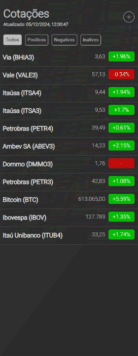
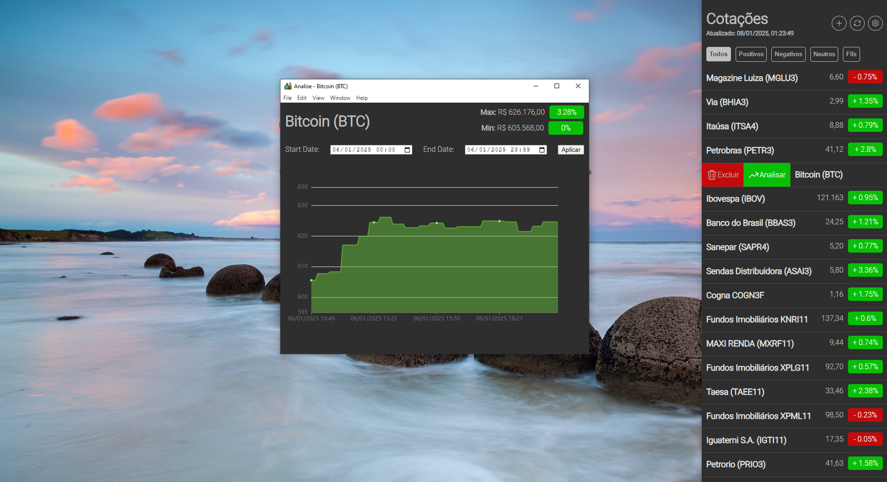

# Stocks app

It's a windows sidebar app built with Electron.js to monitor my stocks while I study the framework.

I'm also using Puppeteer to scrape stock information.

Full-stack project:

- HTML (frontend)
- NodeJs (Backend)
- ElectronJs (Backend)
- Sqlite (Database)
- Puppeteer (web crawler)

### Analyze screen

